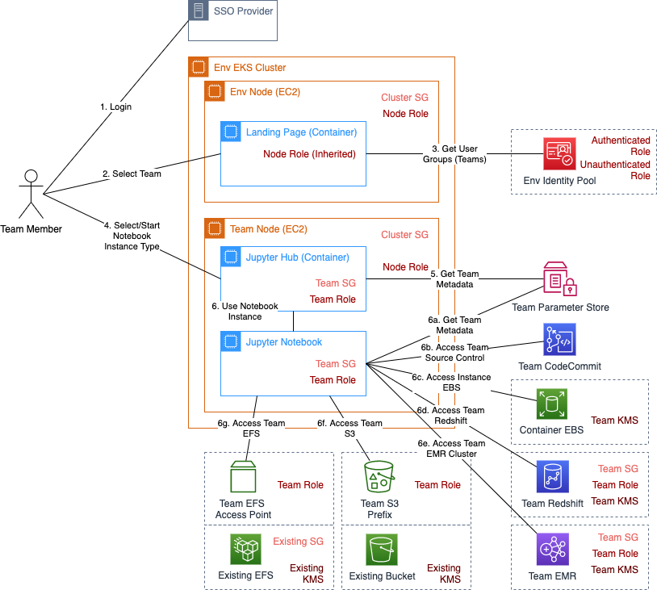

# AWS Orbit Workbench Usage

## Intro
Upon deployment, AWS Orbit Workbench provides a universal Landing Page and Team dedicated Jupyter Hub and Juputer Notebook instances. The Team dedicated instances enable Team members to interact with other Team dedicated resources (e.g. Redshift, EMR) and provide custom integrations with other AWS services.

The Team deidcated resources utilize IAM Roles, Security Groups, and KMS Keys to ensure that Team members are restricted to data intended for use by their Team. During deployment of AWS Orbit Workbench Administrators have the option of attaching additional IAM Managed Policies to the Team Role to enable broader access to data and services. 

## Team Member Usage
1. Team members authenticate with their SSO provider. Integration with the Landing Page uses SAML tokens.
   - Alternatively, a Login page is provided with the Landing Page for organizations that don't use an SSO provider. This is a React.js based web application that uses the AWS Amplify Authentication library to exchange JWT Tokens with Amazon Cognito which authenticates users.
2. Users are taken to the Team Selection page. This page presents a list of Teams the User belongs to.
3. The Amazon Cognito Identity Pool is queried to determine the Teams a User belongs to. Each Orbit Workbench deployment (Env) has a dedicated Identity Pool.
4. Upon selection of a Team, Users are redirected to a Jupyter Hub instance where they can Start or Reconnect to a Jupyter Notebook instance. This Jupyter Hub instance runs on an EKS Managed Node (EC2 Instance) dedicated to the Team.
5. SSM Parameter Store is queried for Metadata describing the Jupyter Notebook Profiles available to members. 
6. Upon selection of the Profile, Users are redirected to a dedicated Jupyter Notebook instance. This Jupyter Notebook instance runs on and EKS Managed Node dedicated to the Team. This Jupyter Notebook instance provides tools and integrations with other AWS Services. Users have the option to use the Jupyter Notebook instance to do data analysis, or to offload analysis to other compute engines (e.g. Redshift, EMR)

    a. Additional Metadata about the integrations and services available to Team members can be retrieved from the Team's dedicated SSM Parameter Store.

    b. An Orbit Workbench Plugin can create and make available a Team dedicated CodeCommit repository.

    c. Each Jupyter Notebook instance has a dedicated EBS Volume attached to supply high speed, ephemeral storage. This volume is encrypted with the Team dedicated KMS Key.

    d. An Orbit Workbench Plugin can create and make available a Team dedicated Redshift Cluster. The Cluster has a Team shared Security Group attached to enable and restrict access, uses the Team IAM Role for access to data in S3, and encrypts data stored in the Cluster with the Team dedicated KMS Key.

    e. An Orbit Workbench Plugin can create and make available one or more Team dedicated EMR Clusters. These clusters attach the Team shared Security Group to their Master to enable and restrict access, use the Team IAM Role as their EC2 Instance Profile, and are configured to encrypt data locally and off-cluster with the Team KMS Key.

    f. Teams are granted read/write access to specific S3 Buckets and Prefixes to be used as "Scratch" space. These preexisting Buckets are provided as input parameters by Administrators when a Team is deployed. The Team IAM Role is configured to grant read/write access to Team dedicated Prefixes within these buckets.

    g. A Team dedicated EFS Access Point is created to provide a shared Team "Drive". The preexisting EFS Volume is provided as an input parameter by Administrators when a Team is deployed. 

## Env and Team Deployemnt
It is expected that organizations will deploy the Orbit Env and one or more Teams into existing AWS environments. Prerequistes of these environments are: 
- S3 Bucket to be used for Team "Scratch" space
- Amazon Cognito User Pool
- EFS Volume 
- Security Group attached to and granting access to the EFS Volume
- VPC
- Public Subnets in the VPC for the Load Balancers
- Private or Isolated Subnets in the VPC for the EKS Managed Nodes (EC2 Instances)
- VPC Endpoints (optional)

AWS Orbit Workbench provides a Foundation Stack that can be deployed to create the prerequisites for organizations wanting a quick start, example of best practices, or just try things out.
